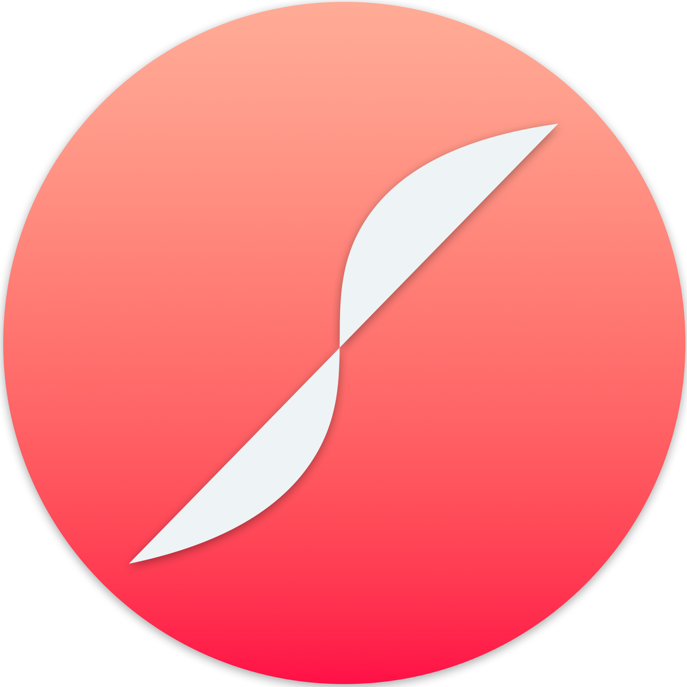

<!-- Improved compatibility of back to top link: See: https://github.com/othneildrew/Best-README-Template/pull/73 -->

<!--
*** Thanks for checking out the Best-README-Template. If you have a suggestion
*** that would make this better, please fork the repo and create a pull request
*** or simply open an issue with the tag "enhancement".
*** Don't forget to give the project a star!
*** Thanks again! Now go create something AMAZING! :D
-->

<!-- PROJECT SHIELDS -->
<!--
*** I'm using markdown "reference style" links for readability.
*** Reference links are enclosed in brackets [ ] instead of parentheses ( ).
*** See the bottom of this document for the declaration of the reference variables
*** for contributors-url, forks-url, etc. This is an optional, concise syntax you may use.
*** https://www.markdownguide.org/basic-syntax/#reference-style-links
-->

<!-- PROJECT LOGO -->
 

  

<h3 align="center">Shortest Path</h3>

  

    A web-game where players attempt to find the shortest possible solution to a multi-solution maze.
     
     
    <!--<a href="https://github.com/TristanKatwaroo/shortest-path"><strong>Explore the docs »</strong></a>-->
    <!-- · -->
    <!-- <a href="https://github.com/TristanKatwaroo/shortest-path/issues/new?labels=bug&template=bug-report---.md">Report Bug</a> -->
    <!-- · -->
    <!-- <a href="https://github.com/TristanKatwaroo/shortest-path/issues/new?labels=enhancement&template=feature-request---.md">Request Feature</a> -->
  

### Built With

[![Mongo][MongoDB]][Mongo-url] [![Express][Express.js]][Express-url] [![React][React.js]][React-url] [![Node][Node.js]][Node-url]

<!-- 
(<a href="#readme-top">back to top</a>)
 -->

<!-- ## About -->

<!-- Centered construction message -->
 
<h3 align="center">This project is under construction! 🚧</h3>
 

  

    <a href="https://tristankatwaroo.com/shortest-path" align="center">Try Demo</a>
  

<!-- LICENSE -->
<!-- ## License

Distributed under the MIT License. See `LICENSE.txt` for more information.

(<a href="#readme-top">back to top</a>)

 -->

<!-- CONTACT -->
<!-- ## Contact

Your Name - [@twitter_handle](https://twitter.com/twitter_handle) - email@email_client.com

Project Link: [https://github.com/TristanKatwaroo/shortest-path](https://github.com/TristanKatwaroo/shortest-path)

(<a href="#readme-top">back to top</a>)
 -->

<!-- MARKDOWN LINKS & IMAGES -->
<!-- https://www.markdownguide.org/basic-syntax/#reference-style-links -->

[React.js]: https://img.shields.io/badge/React-20232A?style=for-the-badge&logo=react&logoColor=61DAFB
[React-url]: https://reactjs.org/
[Node.js]: https://img.shields.io/badge/node.js-6DA55F?style=for-the-badge&logo=node.js&logoColor=white
[Node-url]: https://reactjs.org/
[MongoDB]: https://img.shields.io/badge/MongoDB-%234ea94b.svg?style=for-the-badge&logo=mongodb&logoColor=white
[Mongo-url]: https://reactjs.org/
[Express.js]: https://img.shields.io/badge/express.js-%23404d59.svg?style=for-the-badge&logo=express&logoColor=%2361DAFB
[Express-url]: https://reactjs.org/